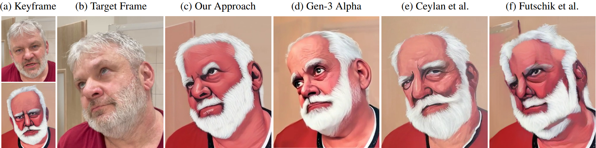

# StructuReiser: A Structure-preserving Video Stylization Method

This repository accompanies the paper accepted to **COMPUTER GRAPHICS Forum** (Vol. 44, 2025, No. 4) by Radim Spetlik, David Futschik, and Daniel Sykora.



## Description

**TL;DR**: keyframe-driven video-to-video method with real-time inference that keeps your video's structure.

We introduce StructuReiser, a novel video-to-video translation method that transforms input videos into stylized sequences using a set of user-provided keyframes. Unlike most existing methods, StructuReiser strictly adheres to the structural elements of the target video, preserving the original identity while seamlessly applying the desired stylistic transformations. This provides a level of control and consistency that is challenging to achieve with text-driven or keyframe-based approaches, including large video models. Furthermore, StructuReiser supports real-time inference on standard graphics hardware as well as custom keyframe editing, enabling interactive applications and expanding possibilities for creative expression and video manipulation.

## Features

- **Structure preservation** – maintains the original content while applying style.
- **Keyframe driven** – stylize a sequence based on a few example frames.
- **Real-time inference** – runs interactively on commodity GPUs.
- **Editable** – modify keyframes to steer the style in specific regions.

## Installation

This repository uses `pipenv` for dependency management. Install the required packages with:

```bash
pipenv install --dev
```

### Singularity environment
We recommend to use Singularity, build the container with:

```bash
bash singularity_build.sh
```

The resulting image will reside in `${PROJECT_DIR}/singularity/structureiser.sif`. The `slurm_job.sh` script detects this file automatically. When present it launches the job inside the container; otherwise it falls back to running the command inside your local `pipenv` environment.

## Inference

Place your input frames in `${INPUT_DIR}` as specified in `config.sh` and run:

```bash
bash evaluate.sh
```

The stylized frames will appear in `${OUTPUT_DIR}`.


## Training

Edit the configuration in `confs/lili.yml` and launch training:

```bash
bash train.sh
```

Training runs through the provided `slurm_job.sh` wrapper.

Note that by default, the training uses `confs/lili.yml` as a configuration file, which uses patch-based regularization for keyframe loss. 
During our experiments, we found that, sometimes, a better approach is to use a full-frame keyframe loss.
Since a few training hyperparameters change, we’ve supplied a dedicated config file 
`confs/lili_full_frame.yml` that employs a full-frame keyframe loss in place of patch-based regularization 
rather than relying on a single switch.


### Provided sequence and checkpoint
This repository ships with the sample sequence and trained model for **Lili**, as shown in the paper. Both can be found under `data/Lili/` and are ready for evaluation.


## Pull Requests

If you find a bug or have a feature request, please open an issue or submit a pull request. Contributions are welcome!


## Citation

If you use StructuReiser in your work, please cite our paper:

```bibtex
@article{spetlik2025structurereiser,
  title={StructuReiser: A Structure-preserving Video Stylization Method},
  author={Spetlik, Radim and Futschik, David and Sykora, Daniel},
  journal={Computer Graphics Forum},
  volume={44},
  number={4},
  year={2025},
}
```

